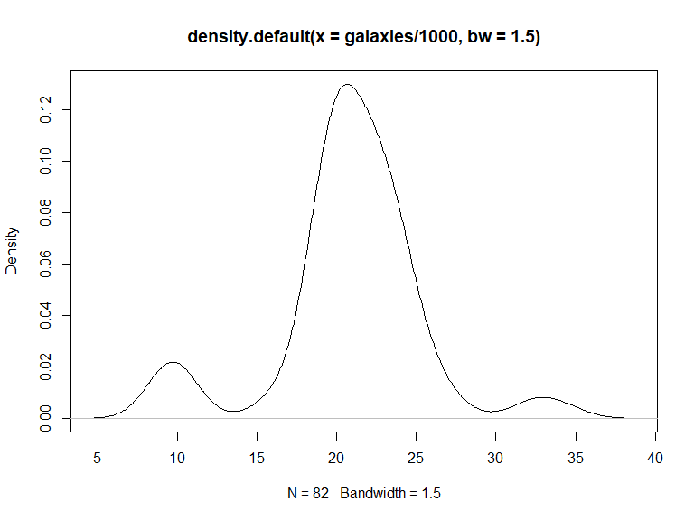
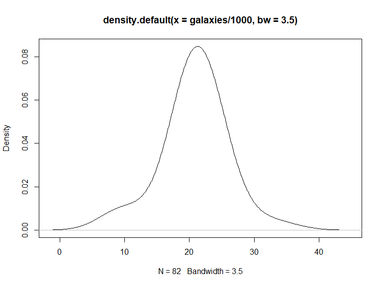

p8160\_hw4\_jsg2145
================
Jared Garfinkel
4/19/2020

``` r
blue <- c(4,69,87,35,39,79,31,79,65,95,68,
          62,70,80,84,79,66,75,59,77,36,86,
          39,85,74,72,69,85,85,72)

red <- c(62,80,82,83,0,81,28,69,48,90,63,
        77,0,55,83,85,54,72,58,68,88,83,78,
        30,58,45,78,64,87,65)

acui <- data.frame(str = c(rep(0,20),
                       rep(1,10)),
                 red,
                 blue)
```

``` r
one_sui_red = acui %>% 
  filter(str == 1) %>% 
  dplyr::select(red)

one_sui_blue = acui %>% 
  filter(str == 1) %>% 
  dplyr::select(blue) %>% 
  as.tibble()
```

``` r
teststat <- function(x = pull(one_sui_red, red), y = pull(one_sui_blue, blue)) {
  return((mean(y) - mean(x))/(var(x)/length(x) + var(y)/length(y)))
}

boottest <- function(x = pull(one_sui_red, red), y = pull(one_sui_blue, blue), nboot = 200) {
  combmean <- mean(c(x, y))
  # The mean of the combined sample
  teststatvec <- rep(NA, nboot)
  adjx <- x - mean(x) + combmean
  # The adjusted X’s will have mean=combmean
  adjy <- y - mean(y) + combmean
  # The adjusted X’s will have mean=combmean
  for(b in 1:nboot) {
    teststatvec[b] <- teststat(sample(adjx, replace=T),
                               sample(adjy, replace=T))
  }
  return(list(bootpval = sum(teststat(x, y) < teststatvec)/nboot, 
              teststatvec = teststatvec))
}
```

``` r
teststat()
```

    ## [1] 0.03824062

``` r
boottest()
```

    ## $bootpval
    ## [1] 0.39
    ## 
    ## $teststatvec
    ##   [1] -3.487950e-01  9.931555e-02  9.457985e-02 -7.826573e-02 -5.926015e-02
    ##   [6] -3.616166e-02  7.547170e-02  9.276278e-02  4.329351e-02 -9.604208e-02
    ##  [11] -4.603635e-02 -3.107561e-02  7.163609e-03  2.962221e-02 -2.326128e-02
    ##  [16] -2.795176e-02 -1.401742e-01 -2.115390e-01  8.317180e-02  7.899281e-02
    ##  [21] -3.518943e-02  3.789199e-02  1.502462e-02  1.780557e-01  4.107213e-03
    ##  [26] -1.596291e-02 -2.350469e-01 -1.518341e-01 -9.772299e-02  2.571274e-02
    ##  [31] -7.656204e-02 -3.905064e-02  5.223250e-02  2.505822e-02 -2.428167e-02
    ##  [36] -7.436114e-02  8.019937e-02  1.418989e-01  8.108108e-02  1.022582e-02
    ##  [41] -1.174997e-01 -1.530827e-01  1.039594e-01 -1.551724e-01 -1.048020e-01
    ##  [46] -3.172320e-02  3.018021e-02  4.719380e-02  6.460573e-02 -1.001047e-01
    ##  [51] -1.394577e-01 -2.956821e-02  1.686020e-01 -4.081453e-01  2.609927e-01
    ##  [56]  1.503524e-01 -1.144770e-01 -5.503465e-02 -2.190912e-01  1.371750e-01
    ##  [61] -1.300766e-03 -9.860105e-02  8.811833e-02 -8.720367e-03  1.507959e-01
    ##  [66]  2.903445e-01  4.536989e-02 -2.831914e-02 -1.356975e-03  4.185317e-02
    ##  [71] -1.902305e-16 -7.203362e-02  1.131972e-01  4.081026e-01  3.961084e-02
    ##  [76]  2.236025e-01  9.907150e-02  2.538110e-01 -1.166615e-01 -2.146531e-02
    ##  [81] -5.592622e-02 -1.684514e-01  7.265417e-02 -1.020768e-01 -3.349876e-02
    ##  [86] -2.395287e-01 -1.167077e-01  4.222226e-02  1.113463e-01  1.207194e-01
    ##  [91] -2.014199e-02 -1.658557e-01 -9.659177e-02  9.275340e-02  2.253175e-02
    ##  [96] -7.063405e-02  4.605766e-01  1.069785e-01  1.712786e-01 -5.105570e-02
    ## [101]  1.231822e-01 -2.710097e-01  1.762226e-01 -8.027857e-02  2.342541e-01
    ## [106]  2.545478e-02  1.805958e-01 -1.374734e-01 -1.929100e-02 -1.073217e-02
    ## [111]  8.618184e-02 -2.325093e-01  1.224165e-01  1.976387e-02  5.531228e-03
    ## [116] -2.576222e-01  2.046811e-02  4.482816e-03  1.014099e-01  4.342391e-02
    ## [121]  4.556822e-01 -1.101283e-01  1.255022e-01 -5.392063e-03 -3.134129e-02
    ## [126]  1.662286e-01  1.598361e-01 -1.004867e-01 -9.058756e-02 -5.873192e-02
    ## [131] -4.763603e-02 -1.825081e-01 -1.972775e-01  6.315920e-02  9.012618e-03
    ## [136] -4.142539e-02  2.340185e-03  2.178988e-02 -1.618427e-01  6.254102e-02
    ## [141] -2.473518e-02  3.762883e-01 -3.520842e-02  1.586226e-01  1.665099e-01
    ## [146] -1.338855e-01 -9.690743e-02 -1.093966e-01  3.548264e-02 -9.957112e-02
    ## [151]  1.483374e-02  8.017360e-02  1.147753e-01 -1.310601e-01  4.096086e-02
    ## [156] -2.002205e-01 -3.615607e-02  9.454459e-02 -2.945731e-02  2.335977e-01
    ## [161]  2.726085e-01  2.062599e-01  4.803573e-02  3.509836e-02  4.746400e-02
    ## [166] -4.792234e-02  4.613936e-02 -7.264062e-02  3.985436e-02 -1.133055e-01
    ## [171]  1.047633e-01  2.123652e-01  4.994481e-01  4.121268e-02 -3.997565e-01
    ## [176] -1.057774e-01  2.894447e-01 -1.256029e-01 -4.355578e-02 -4.461858e-02
    ## [181] -7.874184e-02  3.246608e-01  1.999457e-01 -1.492652e-02  1.225574e-02
    ## [186] -1.316867e-01  2.750851e-02  2.242536e-01 -2.181140e-01  1.815485e-01
    ## [191]  6.598021e-02 -4.602228e-02 -9.304403e-02 -1.490499e-01 -5.343804e-02
    ## [196]  1.243638e-02  1.108850e-01 -1.301780e-01 -6.593062e-02  1.515605e-01

``` r
paired_sample_df = acui %>% 
  filter(str == 0) %>% 
  mutate(diff = red - blue) %>%
  as.tibble()
```

``` r
teststat_paired <- function(x = pull(paired_sample_df, diff)) {
    return(mean(x)/(sqrt(var(x)/length(x))))
}

teststat_paired()
```

    ## [1] -0.5433024

``` r
boottest_paired <- function(diff = pull(paired_sample_df, diff), nboot=200) {
  teststatvec <- rep(NA, nboot)
  adjdiff <- diff - mean(diff)
  for (b in 1:nboot) {
    teststatvec[b] <- teststat_paired(sample(adjdiff, replace = TRUE))
  }
  return(list(bootpval = sum(teststat_paired(diff) < teststatvec)/nboot, 
              teststatvec = teststatvec))
}

boottest_paired()
```

    ## $bootpval
    ## [1] 0.68
    ## 
    ## $teststatvec
    ##   [1] -0.20186563 -2.07813150 -1.38300991 -0.12640145 -0.95432927
    ##   [6] -0.43676164 -0.32585911  0.57733062  0.81929265 -1.36431421
    ##  [11]  1.34164235 -1.20857351  2.25467246 -0.64017560 -0.71008810
    ##  [16]  0.57911855 -0.19644712 -1.93836797 -1.37392654  0.00000000
    ##  [21]  1.68491095 -0.01035944 -0.94770008  0.63947664  0.22216066
    ##  [26]  2.89667697 -0.02445734  1.26722307 -2.15035033 -2.19510899
    ##  [31]  1.03490280 -0.49755029 -0.63066405  0.10113456  0.35768354
    ##  [36]  0.25743190  0.49509080  0.84019799 -0.43136643  1.27988880
    ##  [41] -0.79883094 -0.43294941 -0.72034754  0.03080383 -0.76415170
    ##  [46] -0.15077040  0.70534807  0.51544598 -1.67300779  1.19914234
    ##  [51] -0.52407717  1.57875859 -0.09416304 -1.43240949 -0.33208859
    ##  [56] -0.36802758  1.20372002  1.80558277 -0.72514597 -0.60393904
    ##  [61]  0.45628853  0.19881568  0.47968830  1.19830591 -0.47310528
    ##  [66] -1.11159370  1.28847721  0.33886333 -1.14741588 -0.81875693
    ##  [71]  0.86284066 -1.60598737  0.97338759  1.23826441 -0.28427997
    ##  [76] -1.99091000 -0.93287502  0.98125472  2.07924446 -1.26944115
    ##  [81] -0.59425801 -0.60119572 -1.06476628 -0.72641230  0.89822553
    ##  [86]  0.16754879  0.12742845 -1.08011819  1.32665350  1.19760493
    ##  [91] -0.10910247  1.57779726  0.37443134 -0.40938384  0.03980989
    ##  [96] -0.27449123 -1.40549877 -1.54250373 -2.30406659  0.33455019
    ## [101] -0.70072207 -0.51296786 -1.49453736  1.15877878 -0.92003599
    ## [106] -1.39061130 -0.18939557 -0.38436370  0.64954855  0.03267582
    ## [111]  0.95533557  0.51393775  1.48702610 -0.18492236 -0.14665645
    ## [116]  1.73857810 -1.46134626  0.75987708 -0.45954476 -0.31322196
    ## [121] -0.47974776 -2.24420527  0.92469395  0.12049770 -1.32291284
    ## [126]  0.87248963  0.17860980  0.00792103 -0.14525282  0.45851677
    ## [131]  0.07122232  1.75558143 -0.48565770  0.70313208 -0.81588715
    ## [136]  0.28667214 -2.33504086 -0.33052951 -0.56859238 -0.61241149
    ## [141] -0.46432158  0.17644730 -0.15289962 -0.19425417  0.46436079
    ## [146]  0.52691926 -1.76958031 -1.00739651  0.54733736  0.70155103
    ## [151]  0.59551679  0.14948572 -0.38607919  0.18572393  0.66386734
    ## [156]  0.32467445  1.40496868  0.10991235  0.56797336 -0.93109019
    ## [161]  1.29974297 -1.64989956  0.39142944 -0.44688005 -0.13164624
    ## [166] -0.63506466 -0.68981418  2.07841790 -1.08841989 -1.85227313
    ## [171]  0.73647211  1.51950595 -0.54962599  0.77356503 -1.98454928
    ## [176] -1.27521080  0.18661554  0.98900661  0.84596399 -2.45623343
    ## [181]  1.43938438 -2.87835066 -3.18644827  0.43301033  0.28083026
    ## [186] -0.89446776  2.41976745  0.08520968  0.25881876  0.63158428
    ## [191]  0.93945853 -0.86354825  1.16328204 -0.17238312 -1.86548579
    ## [196] -0.19107086 -0.05305274 -0.94393097  0.06345015  1.23746410

``` r
data(galaxies)
plot(density(galaxies/1000, bw=1.5))
```



``` r
plot(density(galaxies/1000, bw=3.5))
```


