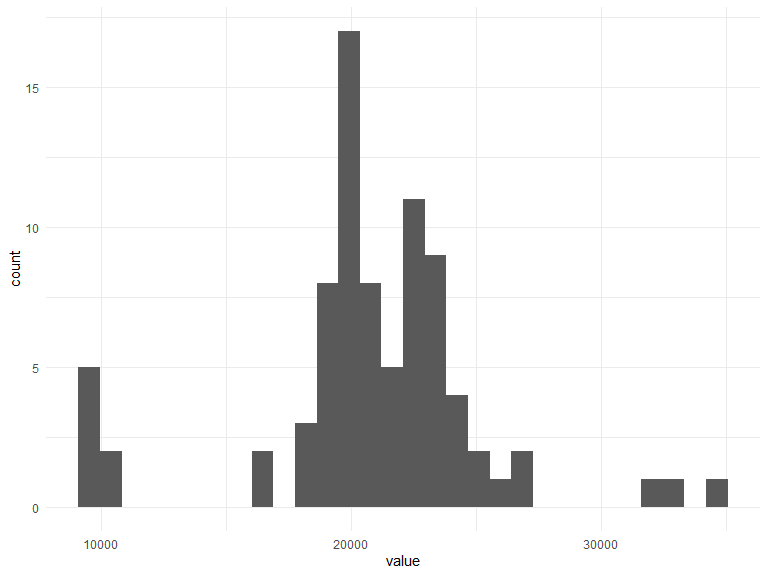
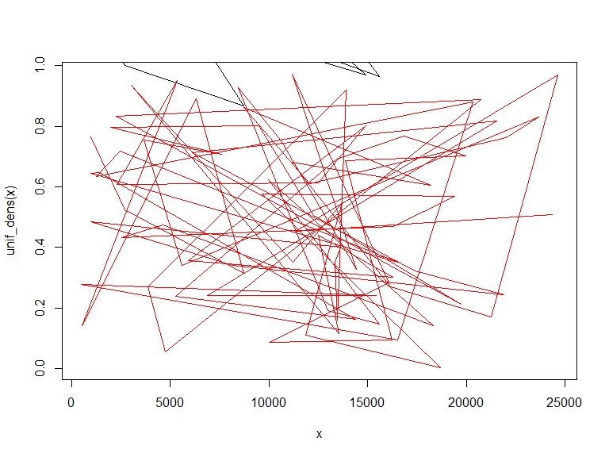

p8160\_hw4\_jsg2145
================
Jared Garfinkel
4/19/2020

``` r
blue <- c(4,69,87,35,39,79,31,79,65,95,68,
          62,70,80,84,79,66,75,59,77,36,86,
          39,85,74,72,69,85,85,72)

red <- c(62,80,82,83,0,81,28,69,48,90,63,
        77,0,55,83,85,54,72,58,68,88,83,78,
        30,58,45,78,64,87,65)

acui <- data.frame(str = c(rep(0,20),
                       rep(1,10)),
                 red,
                 blue)
```

## Part 1i

``` r
one_sui_red = acui %>% 
  filter(str == 1) %>% 
  dplyr::select(red)

one_sui_blue = acui %>% 
  filter(str == 1) %>% 
  dplyr::select(blue) %>% 
  as.tibble()
```

``` r
teststat <- function(x = pull(one_sui_red, red), y = pull(one_sui_blue, blue)) {
  return((mean(y) - mean(x))/(var(x)/length(x) + var(y)/length(y)))
}

boottest <- function(x = pull(one_sui_red, red), y = pull(one_sui_blue, blue), nboot = 200) {
  combmean <- mean(c(x, y))
  # The mean of the combined sample
  teststatvec <- rep(NA, nboot)
  adjx <- x - mean(x) + combmean
  # The adjusted X’s will have mean=combmean
  adjy <- y - mean(y) + combmean
  # The adjusted X’s will have mean=combmean
  for(b in 1:nboot) {
    teststatvec[b] <- teststat(sample(adjx, replace=T),
                               sample(adjy, replace=T))
  }
  return(list(bootpval = sum(teststat(x, y) < teststatvec)/nboot, 
              teststatvec = teststatvec))
}
```

``` r
teststat()
```

    ## [1] 0.03824062

``` r
boottest()
```

    ## $bootpval
    ## [1] 0.39
    ## 
    ## $teststatvec
    ##   [1]  0.111608228 -0.137571529  0.051981214  0.090541279 -0.028881077
    ##   [6]  0.220401399  0.052949163  0.059007141  0.024274391 -0.137931034
    ##  [11]  0.042074917 -0.025932183  0.077844311  0.025052397 -0.030000000
    ##  [16]  0.059560007 -0.068576178  0.085415637  0.330142459  0.122106943
    ##  [21]  0.014475271  0.065678177 -0.022678334 -0.170746293 -0.014879371
    ##  [26] -0.226673900  0.137916288  0.339447550 -0.114989442 -0.078696138
    ##  [31]  0.025678559 -0.333055092 -0.007512772 -0.022595749 -0.109638310
    ##  [36]  0.008353831  0.025912232  0.127466554  0.168844857  0.162568748
    ##  [41] -0.330258673  0.110365842  0.047276150  0.084427767 -0.027676873
    ##  [46] -0.296298863  0.049504270  0.002358212 -0.116321223  0.059290905
    ##  [51]  0.110711037 -0.160350853 -0.034875996  0.181743969 -0.371865297
    ##  [56]  0.340825800  0.056551232 -0.113072674 -0.096577431 -0.048100534
    ##  [61] -0.024150268  0.193252387 -0.135671215  0.048621616 -0.045527949
    ##  [66] -0.040905771  0.111131989  0.176416445  0.012488148 -0.169148708
    ##  [71]  0.016245878 -0.030075188  0.023279876  0.028505068 -0.194171017
    ##  [76] -0.096168882  0.022629649  0.018718413  0.113358363 -0.246202467
    ##  [81]  0.215001222  0.068955732 -0.015995971 -0.089456050 -0.045699778
    ##  [86]  0.083323689  0.105257882  0.102387483 -0.154228281 -0.035765650
    ##  [91]  0.164661282 -0.102795772 -0.054873402  0.128276322 -0.083733912
    ##  [96]  0.238072744 -0.068086179 -0.095544429 -0.098898629 -0.015420709
    ## [101]  0.109936865  0.196909613  0.028462098  0.049107650  0.007755946
    ## [106]  0.040628163 -0.360164647  0.046366145 -0.193892491  0.235460227
    ## [111]  0.149458594 -0.239408434 -0.082815735 -0.122187742 -0.027786672
    ## [116] -0.215006194 -0.005643577 -0.049157303 -0.099035273 -0.027614816
    ## [121] -0.038439245  0.289899370 -0.111130460  0.154349037 -0.297790310
    ## [126] -0.062816477  0.126572707  0.045535714 -0.026260827  0.017864992
    ## [131] -0.160782475  0.161429535 -0.042226427 -0.098521502  0.028106945
    ## [136] -0.033580615  0.001586742 -0.028831715 -0.050344174 -0.207437536
    ## [141]  0.635960188 -0.048969669 -0.079156577  0.071236106  0.186379407
    ## [146] -0.090374989  0.039629246 -0.136662958  0.392232263 -0.151631478
    ## [151]  0.136121246  0.058154405  0.000000000 -0.041448126  0.251492716
    ## [156] -0.091864395  0.019306294  0.242246113 -0.047704420  0.150026966
    ## [161]  0.109850559  0.085313833  0.048920007 -0.191891892 -0.011488058
    ## [166]  0.177592259 -0.093223050 -0.187929974  0.481058839 -0.091407905
    ## [171]  0.081865243  0.050248851  0.053090896 -0.184577523 -0.105486569
    ## [176] -0.119070953  0.018201875  0.035774857  0.099127182  0.187264236
    ## [181]  0.112162972  0.002176410  0.119976475  0.074619835 -0.041904476
    ## [186] -0.012365751 -0.138018984  0.045532326 -0.225370093  0.008327385
    ## [191] -0.006583359 -0.136628341  0.202432522  0.027072938 -0.628138848
    ## [196] -0.113891843 -0.032016506  0.049062089 -0.028464383 -0.168318131

``` r
paired_sample_df = acui %>% 
  filter(str == 0) %>% 
  mutate(diff = red - blue) %>%
  as.tibble()
```

``` r
set.seed(22)
teststat_paired <- function(x = pull(paired_sample_df, diff)) {
    return(mean(x)/(sqrt(var(x)/length(x))))
}

set.seed(22)
boottest_paired <- function(diff = pull(paired_sample_df, diff), nboot=200) {
  teststatvec <- rep(NA, nboot)
  adjdiff <- diff - mean(diff)
  for (b in 1:nboot) {
    teststatvec[b] <- teststat_paired(sample(adjdiff, replace = TRUE))
  }
  return(list(bootpval = sum(teststat_paired(diff) < teststatvec)/nboot, 
              teststatvec = teststatvec))
}

set.seed(22)
boottest_paired()
```

    ## $bootpval
    ## [1] 0.695
    ## 
    ## $teststatvec
    ##   [1]  0.957576295 -0.022370624 -1.054028451 -0.577034097 -1.450720899
    ##   [6] -0.024816519 -1.575152645 -2.633822752  1.704612003  0.509158683
    ##  [11]  0.460948346  2.008182888  0.804934588  0.183665916 -0.471302304
    ##  [16]  1.929950206  0.603356075 -0.111346951  0.236425088  0.229227082
    ##  [21] -0.401614992  0.117134139  1.127811764  1.426999536  1.065242616
    ##  [26]  0.774747804  0.611731503  0.028367292  1.381058734 -0.760918630
    ##  [31] -0.064634824  0.094946239  0.804864586  1.002675784  1.186610143
    ##  [36] -1.008347582  0.521854522  1.059073864 -0.499745056  1.299448399
    ##  [41] -0.542208213  1.017752975 -0.696005030  1.772556269  1.000724861
    ##  [46] -0.403687267 -0.446486363 -2.057092240 -0.298502613  0.808856226
    ##  [51] -0.288606164  1.809229192  1.958058034 -0.226639457 -0.233602846
    ##  [56] -1.470461329 -0.289839230 -0.582855294  0.068433857 -0.639584446
    ##  [61] -1.223342562 -1.138381055 -1.362016269  1.421283168  1.421950719
    ##  [66] -1.520017904  0.261891689 -2.449482898  0.744534627  1.150952309
    ##  [71] -0.308618136 -0.963926888  0.415438583 -0.417544209 -1.137254035
    ##  [76]  0.013577609 -0.062931022  0.546642067  0.048736707 -1.019026230
    ##  [81]  1.945891686 -0.806507704  0.672517057  0.983576888  0.411939767
    ##  [86] -1.348939701 -1.150283861  1.526998439  0.104940775 -0.267298285
    ##  [91]  0.529578144  1.987731620  0.249083767  0.200580367 -0.622611817
    ##  [96]  0.498845149  1.349254182  0.769015255 -2.441879724 -0.656052588
    ## [101] -2.917162029 -0.589972236 -1.219204662 -0.601381705 -0.129826419
    ## [106] -0.487663204  0.670140307 -0.778887054 -1.157142457 -0.521200111
    ## [111]  0.081959431 -0.489478707  0.632514859 -1.798208231 -0.078549346
    ## [116]  1.764412282 -0.596498778 -0.601223252 -0.457398095 -0.882080897
    ## [121]  0.164897017 -0.161453006  1.234431085  2.079115497 -0.040360175
    ## [126]  0.395743976  0.660860384 -0.836636175  0.249253035 -0.243086004
    ## [131] -0.329610582 -0.253815053 -0.579681157 -1.223256486  0.308478310
    ## [136] -0.884898575 -2.176591360 -0.163157204 -0.263735306  0.273042753
    ## [141] -1.107561811  1.404944033  1.447835819 -1.876965146  1.374055732
    ## [146]  0.705149696  0.336866349  0.433902936 -0.634370429 -1.309157240
    ## [151]  1.478370845  1.394084380 -2.554712189 -0.579740873 -1.159310197
    ## [156]  1.428679920  0.522239182 -0.255569713 -0.240859834 -0.459193831
    ## [161]  0.198899537 -1.364305781 -1.434015553  0.485703852 -0.621613350
    ## [166]  1.274019551 -1.852633436 -1.611185892  0.608796185  0.386794494
    ## [171]  0.896587474  0.238547059 -0.821349464 -0.074099713 -0.972724478
    ## [176]  0.718012491  0.744798761 -0.744069480  1.125333848 -1.057597961
    ## [181] -0.395479635  1.571920665  0.048382062 -0.455542561  0.466081777
    ## [186] -1.177513018 -0.254874413  1.828480885 -0.390746821  0.685769900
    ## [191] -0.185499111  0.008983621  1.476246004 -0.582439083  0.123076973
    ## [196]  2.388174014  0.467490284  1.284166659 -0.663028022 -1.086267524

## Problem 1b

``` r
treffect_upper = qnorm(.975, mean = mean(sample(paired_sample_df$diff, size = length(paired_sample_df$diff), replace = TRUE)))
treffect_lower = qnorm(.025, mean = mean(sample(paired_sample_df$diff, size = length(paired_sample_df$diff), replace = TRUE)))

c(treffect_lower, treffect_upper)
```

    ## [1] -2.309964  6.909964

The p-value for the paired samples is 0.65 and the p-value for the
two-sample data is 0.41, which are both greater than 0.05 (\>0.05),
indicating that there is not evidence to suggest a difference.

The confidence interval is (-2.31, 6.91), which is not what would be
expected based on the p-values.

## in parallel

``` r
set.seed(22)
nCores <- detectCores() # detect numbers of available cores 
cl = makeCluster(nCores)
cl
```

    ## socket cluster with 8 nodes on host 'localhost'

``` r
system.time({
res2 = boottest_paired()
})
```

    ##    user  system elapsed 
    ##       0       0       0

``` r
stopCluster(cl)
```

## Problem 2

``` r
data(galaxies)
galaxies %>%
  as_tibble() %>% 
  ggplot(aes(x = value)) +
  geom_histogram()
```

    ## `stat_bin()` using `bins = 30`. Pick better value with `binwidth`.



``` r
plot(density(galaxies/1000, bw=1.5))
```


``` r
plot(density(galaxies/1000, bw=3.5))
```


``` r
#calculate the number of modes in the density
den <- density(galaxies/1000, bw=1.5)
den.s <- smooth.spline(den$x, den$y, all.knots = TRUE, spar = 0.8)
s.1 <- predict(den.s, den.s$x, deriv=1)
nmodes <- length(rle(den.sign <- sign(s.1$y))$values)/2
```

``` r
unif_dens = function(u){
  u = runif(82)
}

data = galaxies

x = rep(NA, 82)
for (i in 1:82) {
  x[i] = unif_dens(u)[[i]] %*% data[[i]]
}

h = (4 * min(sd(data), IQR(data))/(3*200))^(1/5)

kernel = function(x) {
  mean(unif_dens((x - data)/h))/h
}

kernel(x)
```

    ## [1] 0.2613537

``` r
kpdf = function(x) {
  sapply(x, kernel)
}

kpdf(x)
```

    ##  [1] 0.3052535 0.2904226 0.2335151 0.2551579 0.2429064 0.2685964 0.2361574
    ##  [8] 0.2394938 0.2825924 0.2802298 0.2708697 0.2496031 0.2575829 0.2727521
    ## [15] 0.2709521 0.2174171 0.2261209 0.2794149 0.2751300 0.2712368 0.2665116
    ## [22] 0.2971769 0.2816363 0.2699804 0.2377779 0.2655621 0.2413035 0.2437198
    ## [29] 0.2670400 0.2933334 0.2862980 0.2624176 0.2645550 0.2819202 0.2655556
    ## [36] 0.2793238 0.2593900 0.2589355 0.2578916 0.2742556 0.2446879 0.2467353
    ## [43] 0.2693671 0.2592562 0.2508607 0.2653156 0.2656719 0.2766899 0.2556559
    ## [50] 0.2687743 0.2530010 0.2517961 0.2666387 0.2662923 0.2830011 0.2692714
    ## [57] 0.2859677 0.2491910 0.2586846 0.2570340 0.2783758 0.2529073 0.2790781
    ## [64] 0.3028477 0.2775777 0.2732184 0.2826819 0.2810434 0.3095742 0.2784450
    ## [71] 0.2713188 0.2658945 0.2668400 0.2842546 0.2559046 0.2554585 0.2302489
    ## [78] 0.2740709 0.2565015 0.2725445 0.2365751 0.2502229

``` r
plot(x,unif_dens(x), type="l", col="red") 
par(new=T)
plot(x,kpdf(x),type="l",ylim=c(0,0.23),xlab="",ylab="",axes=F)
```


