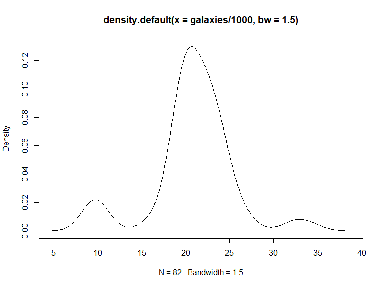

p8160\_hw4\_jsg2145
================
Jared Garfinkel
4/19/2020

``` r
blue <- c(4,69,87,35,39,79,31,79,65,95,68,
          62,70,80,84,79,66,75,59,77,36,86,
          39,85,74,72,69,85,85,72)

red <- c(62,80,82,83,0,81,28,69,48,90,63,
        77,0,55,83,85,54,72,58,68,88,83,78,
        30,58,45,78,64,87,65)

acui <- data.frame(str = c(rep(0,20),
                       rep(1,10)),
                 red,
                 blue)
```

## Part 1i

``` r
one_sui_red = acui %>% 
  filter(str == 1) %>% 
  dplyr::select(red)

one_sui_blue = acui %>% 
  filter(str == 1) %>% 
  dplyr::select(blue) %>% 
  as.tibble()
```

``` r
teststat <- function(x = pull(one_sui_red, red), y = pull(one_sui_blue, blue)) {
  return((mean(y) - mean(x))/(var(x)/length(x) + var(y)/length(y)))
}

boottest <- function(x = pull(one_sui_red, red), y = pull(one_sui_blue, blue), nboot = 200) {
  combmean <- mean(c(x, y))
  # The mean of the combined sample
  teststatvec <- rep(NA, nboot)
  adjx <- x - mean(x) + combmean
  # The adjusted X’s will have mean=combmean
  adjy <- y - mean(y) + combmean
  # The adjusted X’s will have mean=combmean
  for(b in 1:nboot) {
    teststatvec[b] <- teststat(sample(adjx, replace=T),
                               sample(adjy, replace=T))
  }
  return(list(bootpval = sum(teststat(x, y) < teststatvec)/nboot, 
              teststatvec = teststatvec))
}
```

``` r
teststat()
```

    ## [1] 0.03824062

``` r
boottest()
```

    ## $bootpval
    ## [1] 0.415
    ## 
    ## $teststatvec
    ##   [1] -0.031744505  0.178428835  0.077671686  0.059902860  0.072519332
    ##   [6] -0.020798600 -0.148871061 -0.026152387  0.004023245 -0.134441939
    ##  [11]  0.051706803 -0.139010828 -0.157943018  0.301082150  0.039279869
    ##  [16] -0.101578225  0.286908262 -0.064042986 -0.091461755 -0.047796945
    ##  [21]  0.136140766  0.025843342  0.034502037 -0.159900062  0.014373464
    ##  [26] -0.020187859 -0.113552026 -0.036911497  0.103894190 -0.066234913
    ##  [31] -0.085696149 -0.134350290 -0.012686599  0.258977699 -0.011506429
    ##  [36] -0.038615008 -0.248157728 -0.097721609  0.074626866 -0.084147102
    ##  [41]  0.024784427 -0.081689029 -0.110808825  0.204587344  0.165627694
    ##  [46] -0.104188726 -0.018405849 -0.144548095  0.156098471  0.050291159
    ##  [51] -0.008457693 -0.108732486  0.020316639  0.146183989 -0.088407244
    ##  [56] -0.206436513 -0.082890420 -0.107203219  0.177947053 -0.184054166
    ##  [61] -0.047968021 -0.002796899 -0.037009225 -0.018283535 -0.303936030
    ##  [66] -0.143914264  0.092442224 -0.034219693  0.155443365  0.119905529
    ##  [71] -0.030423241 -0.085171027 -0.081811984 -0.062257737 -0.019212109
    ##  [76] -0.206195015 -0.046161378 -0.042892319  0.062683643  0.132557466
    ##  [81]  0.179452958 -0.041132868 -0.021586357  0.263828072 -0.006823765
    ##  [86]  0.110382891  0.090799031 -0.013614446 -0.003739638  0.203788469
    ##  [91]  0.203530785 -0.057806000  0.065005417 -0.144570572  0.433963997
    ##  [96]  0.102577386 -0.075537153  0.111354146 -0.076946217 -0.245621181
    ## [101]  0.206601877 -0.060333001  0.020258863  0.135432576  0.101294316
    ## [106]  0.061743952  0.068810528 -0.042264151  0.106403941 -0.040898468
    ## [111] -0.105180309  0.201793722 -0.083254734  0.283292978  0.038985910
    ## [116] -0.107793786 -0.009902858  0.067506453  0.039955219 -0.101903192
    ## [121]  0.097699884  0.114595688 -0.306426156  0.158187801  0.188300933
    ## [126] -0.227643105 -0.008172902 -0.033792901 -0.007158054  0.211072024
    ## [131]  0.124963734  0.230531503 -0.092715494  0.012479894 -0.068034119
    ## [136] -0.233732297  0.171086399 -0.031322506 -0.082007047  0.118030852
    ## [141]  0.064560756  0.046986564  0.062138043  0.089699507  0.194001874
    ## [146]  0.093717020  0.078567128  0.130496538 -0.042238169  0.063406329
    ## [151] -0.104007594 -0.292027972 -0.168167956  0.057212914  0.062699285
    ## [156] -0.156158358  0.564439228 -0.001781402 -0.034176783  0.110751492
    ## [161]  0.096297578 -0.019107990 -0.258614392  0.341807910 -0.291813760
    ## [166]  0.057032457  0.097181552  0.097659622  0.041460576 -0.076623904
    ## [171] -0.085150144 -0.020072559 -0.196103271  0.144101124  0.300508926
    ## [176] -0.015680808  0.226526241 -0.038316507  0.144106184  0.020024156
    ## [181]  0.053612342 -0.169146158 -0.006862241  0.123253136 -0.104364924
    ## [186] -0.014970593  0.010840108 -0.017022484  0.378367016  0.123172628
    ## [191] -0.030908439  0.005180676 -0.229544991  0.007180756 -0.026898432
    ## [196]  0.108987112  0.130836548 -0.135776309  0.059095802 -0.123595002

``` r
paired_sample_df = acui %>% 
  filter(str == 0) %>% 
  mutate(diff = red - blue) %>%
  as.tibble()
```

``` r
set.seed(22)
teststat_paired <- function(x = pull(paired_sample_df, diff)) {
    return(mean(x)/(sqrt(var(x)/length(x))))
}

set.seed(22)
boottest_paired <- function(diff = pull(paired_sample_df, diff), nboot=200) {
  teststatvec <- rep(NA, nboot)
  adjdiff <- diff - mean(diff)
  for (b in 1:nboot) {
    teststatvec[b] <- teststat_paired(sample(adjdiff, replace = TRUE))
  }
  return(list(bootpval = sum(teststat_paired(diff) < teststatvec)/nboot, 
              teststatvec = teststatvec))
}

set.seed(22)
boottest_paired()
```

    ## $bootpval
    ## [1] 0.695
    ## 
    ## $teststatvec
    ##   [1]  0.957576295 -0.022370624 -1.054028451 -0.577034097 -1.450720899
    ##   [6] -0.024816519 -1.575152645 -2.633822752  1.704612003  0.509158683
    ##  [11]  0.460948346  2.008182888  0.804934588  0.183665916 -0.471302304
    ##  [16]  1.929950206  0.603356075 -0.111346951  0.236425088  0.229227082
    ##  [21] -0.401614992  0.117134139  1.127811764  1.426999536  1.065242616
    ##  [26]  0.774747804  0.611731503  0.028367292  1.381058734 -0.760918630
    ##  [31] -0.064634824  0.094946239  0.804864586  1.002675784  1.186610143
    ##  [36] -1.008347582  0.521854522  1.059073864 -0.499745056  1.299448399
    ##  [41] -0.542208213  1.017752975 -0.696005030  1.772556269  1.000724861
    ##  [46] -0.403687267 -0.446486363 -2.057092240 -0.298502613  0.808856226
    ##  [51] -0.288606164  1.809229192  1.958058034 -0.226639457 -0.233602846
    ##  [56] -1.470461329 -0.289839230 -0.582855294  0.068433857 -0.639584446
    ##  [61] -1.223342562 -1.138381055 -1.362016269  1.421283168  1.421950719
    ##  [66] -1.520017904  0.261891689 -2.449482898  0.744534627  1.150952309
    ##  [71] -0.308618136 -0.963926888  0.415438583 -0.417544209 -1.137254035
    ##  [76]  0.013577609 -0.062931022  0.546642067  0.048736707 -1.019026230
    ##  [81]  1.945891686 -0.806507704  0.672517057  0.983576888  0.411939767
    ##  [86] -1.348939701 -1.150283861  1.526998439  0.104940775 -0.267298285
    ##  [91]  0.529578144  1.987731620  0.249083767  0.200580367 -0.622611817
    ##  [96]  0.498845149  1.349254182  0.769015255 -2.441879724 -0.656052588
    ## [101] -2.917162029 -0.589972236 -1.219204662 -0.601381705 -0.129826419
    ## [106] -0.487663204  0.670140307 -0.778887054 -1.157142457 -0.521200111
    ## [111]  0.081959431 -0.489478707  0.632514859 -1.798208231 -0.078549346
    ## [116]  1.764412282 -0.596498778 -0.601223252 -0.457398095 -0.882080897
    ## [121]  0.164897017 -0.161453006  1.234431085  2.079115497 -0.040360175
    ## [126]  0.395743976  0.660860384 -0.836636175  0.249253035 -0.243086004
    ## [131] -0.329610582 -0.253815053 -0.579681157 -1.223256486  0.308478310
    ## [136] -0.884898575 -2.176591360 -0.163157204 -0.263735306  0.273042753
    ## [141] -1.107561811  1.404944033  1.447835819 -1.876965146  1.374055732
    ## [146]  0.705149696  0.336866349  0.433902936 -0.634370429 -1.309157240
    ## [151]  1.478370845  1.394084380 -2.554712189 -0.579740873 -1.159310197
    ## [156]  1.428679920  0.522239182 -0.255569713 -0.240859834 -0.459193831
    ## [161]  0.198899537 -1.364305781 -1.434015553  0.485703852 -0.621613350
    ## [166]  1.274019551 -1.852633436 -1.611185892  0.608796185  0.386794494
    ## [171]  0.896587474  0.238547059 -0.821349464 -0.074099713 -0.972724478
    ## [176]  0.718012491  0.744798761 -0.744069480  1.125333848 -1.057597961
    ## [181] -0.395479635  1.571920665  0.048382062 -0.455542561  0.466081777
    ## [186] -1.177513018 -0.254874413  1.828480885 -0.390746821  0.685769900
    ## [191] -0.185499111  0.008983621  1.476246004 -0.582439083  0.123076973
    ## [196]  2.388174014  0.467490284  1.284166659 -0.663028022 -1.086267524

The p-value for the paired samples is 0.65 and the p-value for the
two-sample data is 0.45, which are both greater than 0.05 (\>0.05),
indicating that there is not evidence to suggest a difference.

## in parallel

``` r
set.seed(22)
nCores <- detectCores() # detect numbers of available cores 
cl = makeCluster(nCores)
cl
```

    ## socket cluster with 8 nodes on host 'localhost'

``` r
system.time({
res2 = boottest_paired()
})
```

    ##    user  system elapsed 
    ##    0.01    0.00    0.02

``` r
stopCluster(cl)
```

## Problem 2

``` r
data(galaxies)
plot(density(galaxies/1000, bw=1.5))
```


``` r
plot(density(galaxies/1000, bw=3.5))
```



``` r
#calculate the number of modes in the density
den <- density(galaxies/1000, bw=1.5)
den.s <- smooth.spline(den$x, den$y, all.knots = TRUE, spar = 0.8)
s.1 <- predict(den.s, den.s$x, deriv=1)
nmodes <- length(rle(den.sign <- sign(s.1$y))$values)/2
```

``` r
unif_dens = function(x = galaxies) {
    exp(-.5*x^2)/sqrt(2*pi)
}

h = (4 * min(sd(galaxies), IQR(galaxies))/(3*200))^(1/5)


min_ban = function(x = galaxies, nboot = 200) {
  den = sample(x, size = nboot, replace = TRUE)
  kernel = mean(norm_dens((den - x)/h)/h)
}

kpdf = function(x = galaxies) {
  sapply(x, min_ban)
}
```
