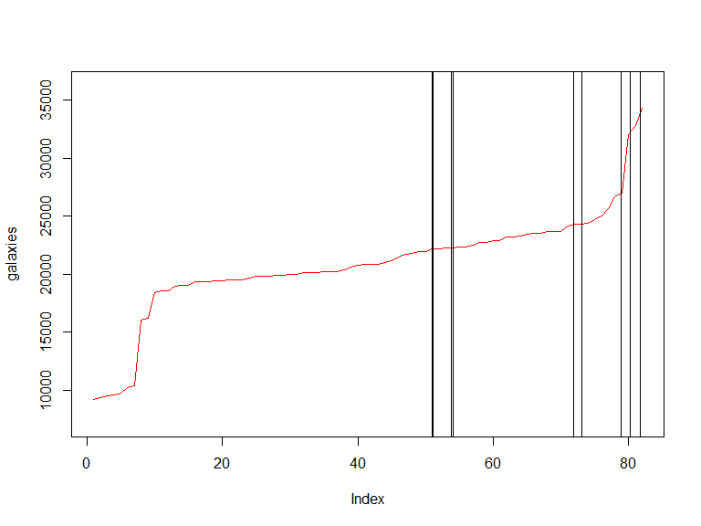

p8160\_hw4\_jsg2145
================
Jared Garfinkel
4/19/2020

``` r
blue <- c(4,69,87,35,39,79,31,79,65,95,68,
          62,70,80,84,79,66,75,59,77,36,86,
          39,85,74,72,69,85,85,72)

red <- c(62,80,82,83,0,81,28,69,48,90,63,
        77,0,55,83,85,54,72,58,68,88,83,78,
        30,58,45,78,64,87,65)

acui <- data.frame(str = c(rep(0,20),
                       rep(1,10)),
                 red,
                 blue)
```

## Part 1i

``` r
one_sui_red = acui %>% 
  filter(str == 1) %>% 
  dplyr::select(red)

one_sui_blue = acui %>% 
  filter(str == 1) %>% 
  dplyr::select(blue) %>% 
  as.tibble()
```

``` r
teststat <- function(x = pull(one_sui_red, red), y = pull(one_sui_blue, blue)) {
  return((mean(y) - mean(x))/(var(x)/length(x) + var(y)/length(y)))
}

boottest <- function(x = pull(one_sui_red, red), y = pull(one_sui_blue, blue), nboot = 200) {
  combmean <- mean(c(x, y))
  # The mean of the combined sample
  teststatvec <- rep(NA, nboot)
  adjx <- x - mean(x) + combmean
  # The adjusted X’s will have mean=combmean
  adjy <- y - mean(y) + combmean
  # The adjusted X’s will have mean=combmean
  for(b in 1:nboot) {
    teststatvec[b] <- teststat(sample(adjx, replace=T),
                               sample(adjy, replace=T))
  }
  return(list(bootpval = sum(teststat(x, y) < teststatvec)/nboot, 
              teststatvec = teststatvec))
}
```

``` r
teststat()
```

    ## [1] 0.03824062

``` r
boottest()
```

    ## $bootpval
    ## [1] 0.38
    ## 
    ## $teststatvec
    ##   [1]  0.083396852 -0.116936615  0.043607066  0.021616140  0.125267277
    ##   [6] -0.060464169 -0.072483551 -0.218597001 -0.085101680 -0.390598144
    ##  [11] -0.271819263 -0.051805083 -0.177275690  0.002448147  0.159963227
    ##  [16]  0.022009823 -0.020650359  0.111871735  0.162977867 -0.291103358
    ##  [21]  0.033662238 -0.178094800  0.268943436  0.126512304  0.013736645
    ##  [26] -0.114074820 -0.083182332  0.300918693  0.233393605 -0.130496454
    ##  [31] -0.121394791  0.016675693 -0.125935568 -0.038353246  0.035446096
    ##  [36]  0.012052899  0.064916850  0.145456961  0.124178346 -0.163421419
    ##  [41]  0.120863773  0.099726776  0.029692833  0.044146779  0.010281014
    ##  [46] -0.014355085  0.078915766 -0.014424233  0.395025604 -0.085212287
    ##  [51] -0.128589134 -0.151382303 -0.022095830  0.093023256 -0.037087912
    ##  [56] -0.312247022 -0.052227480 -0.109761197 -0.041814545 -0.206436513
    ##  [61]  0.117385202  0.004050284 -0.050760434 -0.219370564 -0.066364852
    ##  [66]  0.082663330 -0.113404400  0.137303723 -0.112859450  0.148273313
    ##  [71] -0.334135442 -0.330355638 -0.039676484  0.170949026 -0.017927159
    ##  [76]  0.021955504 -0.071697346 -0.023110626 -0.131049546 -0.225340737
    ##  [81]  0.194870885  0.095447871 -0.028762724  0.141270225  0.074522216
    ##  [86]  0.159233108  0.026455999 -0.070277361 -0.134471046  0.075137404
    ##  [91] -0.217290371 -0.054104114  0.216389143  0.180099238 -0.089682571
    ##  [96] -0.066814191 -0.069141240  0.071281270  0.048135299  0.127037392
    ## [101] -0.170248777 -0.022582922  0.179881397  0.053264287 -0.347739261
    ## [106]  0.288695870  0.074493824 -0.056054170  0.059260747 -0.090671286
    ## [111]  0.139716686 -0.036321990 -0.069524913  0.041578441 -0.078555337
    ## [116] -0.121912216 -0.062254681 -0.178381822 -0.039853239  0.048260145
    ## [121] -0.056897621  0.140133616 -0.034312947 -0.097235791 -0.030389364
    ## [126] -0.020216931 -0.050542465  0.068143101  0.056043877  0.068822109
    ## [131] -0.009494472  0.026746797 -0.054525927  0.012605042  0.130136986
    ## [136]  0.161688472 -0.139708574  0.064015648  0.024904605  0.015436447
    ## [141] -0.075777123 -0.067881179  0.085833189  0.167137523 -0.087583651
    ## [146] -0.114014058 -0.049198869  0.000000000 -0.068596254  0.111880447
    ## [151] -0.137002910 -0.132459565 -0.255807343 -0.043659492  0.104342327
    ## [156] -0.209892996 -0.121535683 -0.152663908  0.209719047  0.078097883
    ## [161] -0.110211279  0.180255078  0.049218947 -0.048337856  0.055259219
    ## [166]  0.002844276  0.007916960  0.053431338 -0.113665653 -0.044892086
    ## [171] -0.022417894  0.057743957  0.110929299  0.230112499  0.466897233
    ## [176] -0.209813875  0.130082956  0.094247246  0.073451033  0.268871699
    ## [181]  0.022154495  0.017879520 -0.153621352  0.299916690  0.070252015
    ## [186] -0.173368244  0.196812454 -0.062368572 -0.081230769  0.037695458
    ## [191]  0.294502618 -0.153226350 -0.082182399  0.072721151  0.060100167
    ## [196] -0.028259100  0.115833357  0.060003478 -0.040261851 -0.030387155

``` r
paired_sample_df = acui %>% 
  filter(str == 0) %>% 
  mutate(diff = red - blue) %>%
  as.tibble()
```

``` r
set.seed(22)
teststat_paired <- function(x = pull(paired_sample_df, diff)) {
    return(mean(x)/(sqrt(var(x)/length(x))))
}

set.seed(22)
boottest_paired <- function(diff = pull(paired_sample_df, diff), nboot=200) {
  teststatvec <- rep(NA, nboot)
  adjdiff <- diff - mean(diff)
  for (b in 1:nboot) {
    teststatvec[b] <- teststat_paired(sample(adjdiff, replace = TRUE))
  }
  return(list(bootpval = sum(teststat_paired(diff) < teststatvec)/nboot, 
              teststatvec = teststatvec))
}

set.seed(22)
boottest_paired()
```

    ## $bootpval
    ## [1] 0.695
    ## 
    ## $teststatvec
    ##   [1]  0.957576295 -0.022370624 -1.054028451 -0.577034097 -1.450720899
    ##   [6] -0.024816519 -1.575152645 -2.633822752  1.704612003  0.509158683
    ##  [11]  0.460948346  2.008182888  0.804934588  0.183665916 -0.471302304
    ##  [16]  1.929950206  0.603356075 -0.111346951  0.236425088  0.229227082
    ##  [21] -0.401614992  0.117134139  1.127811764  1.426999536  1.065242616
    ##  [26]  0.774747804  0.611731503  0.028367292  1.381058734 -0.760918630
    ##  [31] -0.064634824  0.094946239  0.804864586  1.002675784  1.186610143
    ##  [36] -1.008347582  0.521854522  1.059073864 -0.499745056  1.299448399
    ##  [41] -0.542208213  1.017752975 -0.696005030  1.772556269  1.000724861
    ##  [46] -0.403687267 -0.446486363 -2.057092240 -0.298502613  0.808856226
    ##  [51] -0.288606164  1.809229192  1.958058034 -0.226639457 -0.233602846
    ##  [56] -1.470461329 -0.289839230 -0.582855294  0.068433857 -0.639584446
    ##  [61] -1.223342562 -1.138381055 -1.362016269  1.421283168  1.421950719
    ##  [66] -1.520017904  0.261891689 -2.449482898  0.744534627  1.150952309
    ##  [71] -0.308618136 -0.963926888  0.415438583 -0.417544209 -1.137254035
    ##  [76]  0.013577609 -0.062931022  0.546642067  0.048736707 -1.019026230
    ##  [81]  1.945891686 -0.806507704  0.672517057  0.983576888  0.411939767
    ##  [86] -1.348939701 -1.150283861  1.526998439  0.104940775 -0.267298285
    ##  [91]  0.529578144  1.987731620  0.249083767  0.200580367 -0.622611817
    ##  [96]  0.498845149  1.349254182  0.769015255 -2.441879724 -0.656052588
    ## [101] -2.917162029 -0.589972236 -1.219204662 -0.601381705 -0.129826419
    ## [106] -0.487663204  0.670140307 -0.778887054 -1.157142457 -0.521200111
    ## [111]  0.081959431 -0.489478707  0.632514859 -1.798208231 -0.078549346
    ## [116]  1.764412282 -0.596498778 -0.601223252 -0.457398095 -0.882080897
    ## [121]  0.164897017 -0.161453006  1.234431085  2.079115497 -0.040360175
    ## [126]  0.395743976  0.660860384 -0.836636175  0.249253035 -0.243086004
    ## [131] -0.329610582 -0.253815053 -0.579681157 -1.223256486  0.308478310
    ## [136] -0.884898575 -2.176591360 -0.163157204 -0.263735306  0.273042753
    ## [141] -1.107561811  1.404944033  1.447835819 -1.876965146  1.374055732
    ## [146]  0.705149696  0.336866349  0.433902936 -0.634370429 -1.309157240
    ## [151]  1.478370845  1.394084380 -2.554712189 -0.579740873 -1.159310197
    ## [156]  1.428679920  0.522239182 -0.255569713 -0.240859834 -0.459193831
    ## [161]  0.198899537 -1.364305781 -1.434015553  0.485703852 -0.621613350
    ## [166]  1.274019551 -1.852633436 -1.611185892  0.608796185  0.386794494
    ## [171]  0.896587474  0.238547059 -0.821349464 -0.074099713 -0.972724478
    ## [176]  0.718012491  0.744798761 -0.744069480  1.125333848 -1.057597961
    ## [181] -0.395479635  1.571920665  0.048382062 -0.455542561  0.466081777
    ## [186] -1.177513018 -0.254874413  1.828480885 -0.390746821  0.685769900
    ## [191] -0.185499111  0.008983621  1.476246004 -0.582439083  0.123076973
    ## [196]  2.388174014  0.467490284  1.284166659 -0.663028022 -1.086267524

The p-value for the paired samples is 0.65 and the p-value for the
two-sample data is 0.45, which are both greater than 0.05 (\>0.05),
indicating that there is not evidence to suggest a difference.

## in parallel

``` r
set.seed(22)
nCores <- detectCores() # detect numbers of available cores 
cl = makeCluster(nCores)
cl
```

    ## socket cluster with 8 nodes on host 'localhost'

``` r
system.time({
res2 = boottest_paired()
})
```

    ##    user  system elapsed 
    ##       0       0       0

``` r
stopCluster(cl)
```

## Problem 2

``` r
data(galaxies)
galaxies %>%
  as_tibble() %>% 
  ggplot(aes(x = value)) +
  geom_histogram()
```

    ## `stat_bin()` using `bins = 30`. Pick better value with `binwidth`.


``` r
plot(density(galaxies/1000, bw=1.5))
```


``` r
plot(density(galaxies/1000, bw=3.5))
```


``` r
#calculate the number of modes in the density
den <- density(galaxies/1000, bw=1.5)
den.s <- smooth.spline(den$x, den$y, all.knots = TRUE, spar = 0.8)
s.1 <- predict(den.s, den.s$x, deriv=1)
nmodes <- length(rle(den.sign <- sign(s.1$y))$values)/2
```

``` r
unif_dens = function(u){
  u = runif(82)
}

data = galaxies

x = rep(NA, 82)
for (i in 1:82) {
  x[i] = unif_dens(u)[[i]] %*% data[[i]]
}

h = (4 * min(sd(data), IQR(data))/(3*200))^(1/5)

kernel = function(x) {
  mean(((x - data)/h))/h
}

kernel(x)
```

    ## [1] -2630.159

``` r
kpdf = function(x) {
  sapply(x, kernel)
}

kpdf(x)
```

    ##  [1] -5572.57723 -5089.29315 -3395.06524 -4072.32165 -5691.22977
    ##  [6] -4342.01750 -5202.76324 -2331.29332 -1658.60325 -4184.12556
    ## [11] -1274.10785 -2338.50637 -2040.88025 -4991.37682 -2702.45023
    ## [16] -1999.71104 -2515.37462  -600.53540 -3136.30290  -402.03351
    ## [21] -1273.64206 -5136.40872 -4548.60730  -704.31537 -3041.21339
    ## [26] -1463.23175 -2199.81708 -3469.55651 -2867.88051 -1793.07286
    ## [31] -2711.23078 -1328.95025 -3038.14124 -1291.05592 -1948.89881
    ## [36]  -244.46479 -1115.73342 -2080.48664 -4359.64012 -1809.99132
    ## [41] -5451.41025 -5569.62056 -1212.43261 -5157.51440 -5489.93899
    ## [46]  -141.05629 -1210.73134 -5703.25766 -1511.22065 -3912.74230
    ## [51]   196.11509 -4125.72891  -960.17787   299.22284 -3553.81587
    ## [56] -5576.37462 -2021.49947 -2099.56598 -2065.03904 -1947.27328
    ## [61] -4758.23121 -4508.99588   -31.78503 -5214.99425  -313.04214
    ## [66] -2404.83499 -3183.96283 -5283.79012 -3714.06560 -4820.96505
    ## [71] -4269.33965   795.97445   330.33719 -2462.49475 -3398.32221
    ## [76]  -741.36038 -2719.50175 -1307.92503   123.60221  1068.42470
    ## [81] -2667.21983   990.45266

``` r
plot(galaxies, type="l", ylim=c(min(galaxies)-2000, max(galaxies) + 2000), col="red") 
par(new=T)
plot(kpdf(x),type="l",ylim=c(0,0.23),xlab="",ylab="",axes=F)
```


